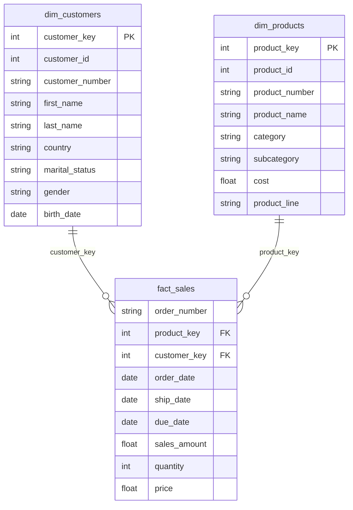

# CRM + ERP Medallion Data Warehouse

A Bronze → Silver → Gold pipeline that merges two disconnected source systems — a **CRM** (customer, product, sales data) and an **ERP** (customer demographics, location, product category) — into a single, query-ready star schema, built on **Python + DuckDB**.

This isn't a synthetic demo: the source files have real, messy data quality problems (duplicate keys, inconsistent ID formats between systems, bad dates, price/sales mismatches), and the Silver layer exists specifically to resolve each one. See [Data Quality Rules](#data-quality-rules-applied) below for the full list, discovered by profiling the actual data.

## Why Medallion Architecture

Raw source data is rarely safe to report on directly, and cleaning it "in place" destroys your ability to debug or reprocess. The Medallion pattern solves this with three layers, each with a single responsibility:

| Layer | Purpose | Contains |
|---|---|---|
| **Bronze** | Raw ingestion, zero transformation | Exact copy of source CSVs, with ingestion metadata |
| **Silver** | Cleaned, deduplicated, conformed | One clean version of each source table, all data quality issues resolved |
| **Gold** | Business-ready, dimensional | A star schema (`dim_customers`, `dim_products`, `fact_sales`) ready for BI tools |

Every layer is a real, queryable DuckDB table — nothing is thrown away, so any downstream number can always be traced back to its raw source.

## Architecture

```
        CRM Source                    ERP Source
   +--------------------+       +-----------------------+
   | cust_info.csv      |       | CUST_AZ12.csv          |
   | prd_info.csv       |       | LOC_A101.csv           |
   | sales_details.csv  |       | PX_CAT_G1V2.csv        |
   +---------+----------+       +-----------+------------+
             |                              |
             v                              v
   ================== BRONZE ==========================
     bronze.crm_*                    bronze.erp_*
     (raw, as-received, + _ingested_at / _source_file)
   =====================================================
                        |
                        v
   ================== SILVER ==========================
     Dedup, standardize keys, fix dates, recompute sales
     silver.crm_*                    silver.erp_*
   =====================================================
                        |
                        v
   =================== GOLD ===========================
           gold.dim_customers   gold.dim_products
                       \             /
                        gold.fact_sales
   =====================================================
```

## Gold layer star schema



## Data quality rules applied

Found by profiling the raw files (`src/silver.py` docstring has the full breakdown):

| Source table | Issue found | Fix applied |
|---|---|---|
| `crm_cust_info` | 9 duplicate `cst_id` | Keep most recent row per customer by `cst_create_date` |
| `crm_cust_info` | Gender/marital status as raw codes (`M`/`S`/null) | Mapped to `Married`/`Single`/`Male`/`Female`/`n/a` |
| `crm_prd_info` | `prd_key` encodes a hidden category id | Split into `cat_id` + clean `prd_key` |
| `crm_prd_info` | 2 null costs, overlapping/wrong end dates | Cost defaulted to 0; end date recomputed as (next start date − 1 day) |
| `crm_sales_details` | Dates stored as `YYYYMMDD` integers, 17 invalid | Parsed to real dates, invalid values set to null |
| `crm_sales_details` | 7 null / 5 zero-or-negative prices, 35 sales≠qty×price | Price backfilled from sales÷quantity; sales recomputed as quantity×price wherever inconsistent |
| `erp_cust_az12` | `CID` has an inconsistent `NAS` prefix vs. `AW` used elsewhere | Prefix stripped so keys join cleanly to CRM |
| `erp_cust_az12` | Some birthdates are in the future | Set to null |
| `erp_loc_a101` | `CID` contains a dash the CRM key doesn't | Dash stripped |
| `erp_loc_a101` | Inconsistent country values (`DE`, `US`, `USA`, blank) | Standardized to full country names |

All rules are enforced and re-verified by `src/data_quality.py` on every run (7 automated checks: no duplicate keys, sales=qty×price, no negative cost, zero orphaned fact rows, no duplicate surrogate keys).

## Project structure

```
.
├── data/
│   ├── source_crm/          # cust_info.csv, prd_info.csv, sales_details.csv
│   └── source_erp/          # CUST_AZ12.csv, LOC_A101.csv, PX_CAT_G1V2.csv
├── src/
│   ├── bronze.py            # Raw ingestion
│   ├── silver.py            # Cleaning + conforming logic
│   ├── gold.py               # Star schema build (dim/fact SQL)
│   └── data_quality.py      # Automated DQ checks
├── main.py                  # Orchestrates the full pipeline end-to-end
├── outputs/                 # warehouse.duckdb + exported gold_*.csv (generated)
├── requirements.txt
├── .gitignore
├── LICENSE
└── README.md
```

## Setup

```bash
git clone https://github.com/<your-username>/crm-erp-medallion.git
cd crm-erp-medallion
pip install -r requirements.txt
```

## Usage

```bash
python main.py
```

This runs Bronze → Silver → Gold → data quality checks in sequence, then exports the three Gold tables to CSV. Everything is also queryable directly in `outputs/warehouse.duckdb`:

```bash
python -c "
import duckdb
con = duckdb.connect('outputs/warehouse.duckdb')
print(con.execute('''
    SELECT c.country, SUM(f.sales_amount) AS total_sales
    FROM gold.fact_sales f
    JOIN gold.dim_customers c ON f.customer_key = c.customer_key
    GROUP BY c.country ORDER BY total_sales DESC
''').fetchdf())
"
```

## Roadmap / next steps

- [ ] Add `dim_date` for cleaner time-intelligence in BI tools
- [ ] Incremental loads (currently full-refresh on every run)
- [ ] Orchestrate with Airflow/Dagster instead of a single `main.py`
- [ ] Add a `dbt` version of the Silver/Gold SQL for lineage graphs and tests
- [ ] Connect Gold tables to a BI tool (Looker/Power BI/Tableau) for a reporting layer

## License

MIT — see [LICENSE](LICENSE).
